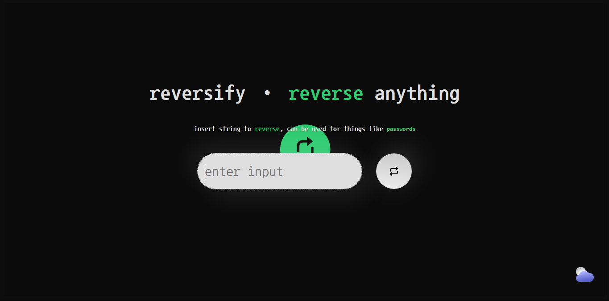

# reversify

This app reverses whatever passed to the input field.



## Why?

A lot of times I find myself needing to reverse a string or number, generally when creating temporary accounts I seem to reverse the temp-mail and use it as a password.

I've created this app to help me with that.

## Clone

```bash
pnpm install
pnpm run dev
```

## Deploy

```bash
npm run deploy
```

Output Directory: `/dist`
